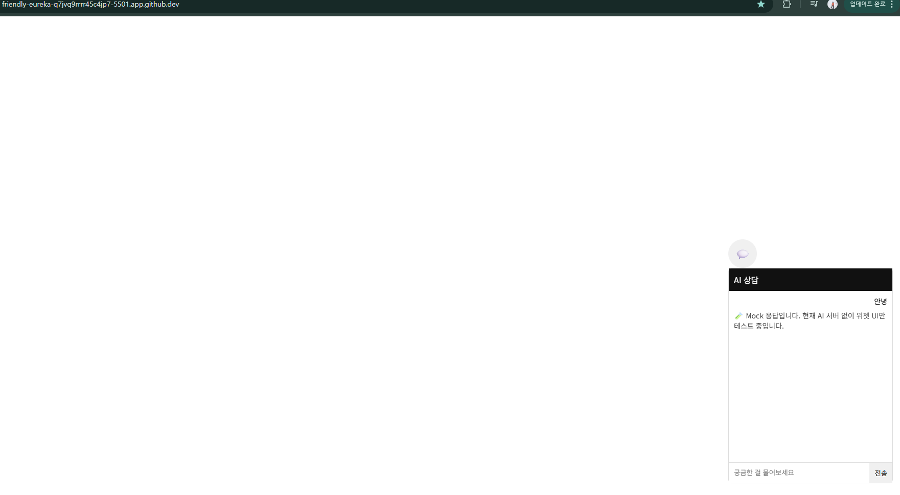

## Demo (Mock Mode)

Scenario-based AI consulting widget (UI prototype).
Currently running in mock mode without external AI APIs.

# ai-consulting-engine

Scenario-based AI consulting widget for websites.

This repository contains a reusable AI chat widget and backend engine
designed to support multiple consulting scenarios such as:
- Company website consulting
- E-commerce product assistance
- Delivery service support
- Automated website creation consulting
- Local information recommendations

## Status
This project is in an early experimental phase.
Not intended for production use yet.

## Core Concept
- One engine
- Multiple consulting scenarios
- Pluggable UI and backend
- No hardcoded business logic

## Repository Structure
- widget/      : Embeddable web chat widget (frontend)
- api/         : Backend API for session and LLM orchestration
- scenarios/   : Scenario definitions (prompts, flows, rules)
- docs/        : Architecture and design notes

## Security
- No secrets or credentials are committed
- Database files and runtime data are excluded
